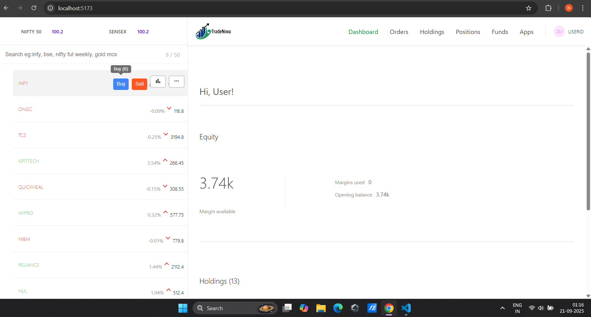
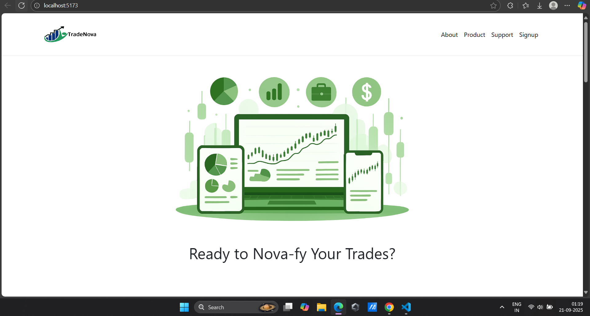
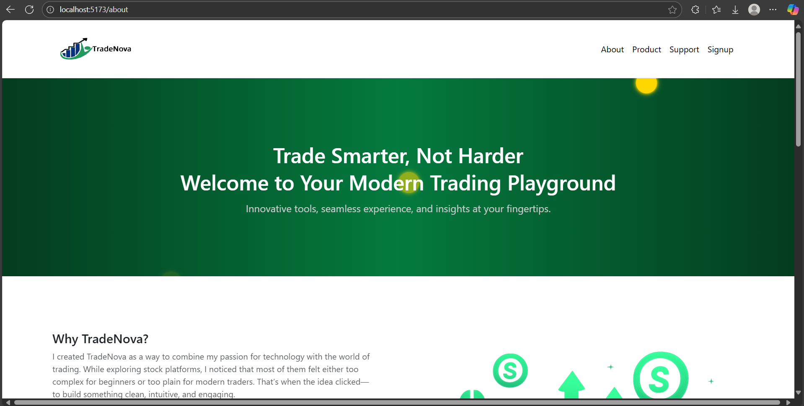

# TradeNova

TradeNova is a stock trading dashboard application built with **Express.js** and **MongoDB**.  
It allows users to buy stocks in specific quantities, which are stored in the database and reflected in the dashboard in real-time.

---

## 🚀 Tech Stack
- **Frontend**: React.js, Bootstrap, CSS, HTML  
- **Backend**: Node.js, Express.js  
- **Database**: MongoDB  

---

## ✨ Features
- User-friendly stock dashboard.  
- Buy stocks of any quantity.  
- Transactions are stored in **MongoDB**.  
- Real-time reflection of holdings after purchase.  

---


---

## ⚡ Setup Instructions

### 1️⃣ Clone the repository
```bash
git clone https://github.com/yourusername/tradenova.git
cd tradenova
```
### Backend 
```bash
cd backend
npm install
npm start
```

### Create a .env file in the backend folder:
```
PORT=5000
MONGO_URL=your_mongodb_connection_string 
```

### 3️⃣ Frontend setup
```
cd frontend
npm install
npm start
``` 






